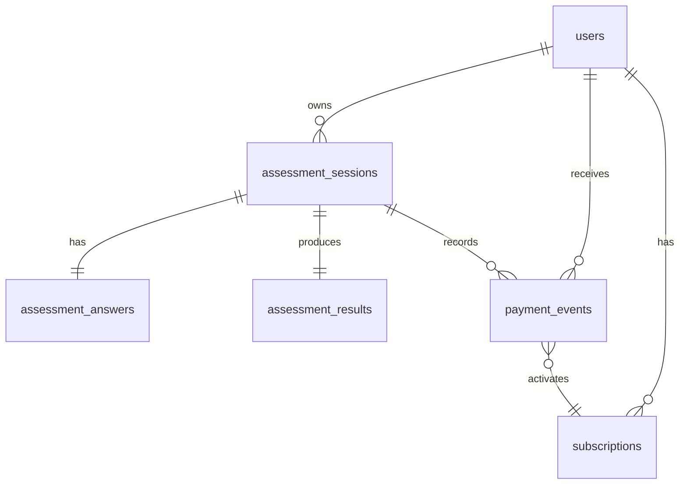

# 健康测评系统

健康测评系统 MVP 起步工程骨架。当前阶段重点是冻结业务边界、接口契约、数据模型、状态机、权限裁剪和测试验收标准；真实业务实现交给下一阶段开发者补齐。

## 当前边界

- 不连接公网。
- 不实现复杂前端。
- API route 和 service 已占位，业务逻辑为 contract stub。
- 提供本地可运行页面：`npm run mock:dev`。

## 快速启动

```bash
npm run mock:dev
```

打开：

```text
http://localhost:3000
```

该 mock 服务使用 Node 标准库，不依赖 `node_modules`，用于当前阶段端口页面和接口契约预览。

后续安装依赖后可使用标准 Next.js 流程：

```bash
npm install
cp .env.example .env
npx prisma migrate dev
npm run dev
```

## 核心 API

| 方法 | 路径 | 用途 |
| --- | --- | --- |
| POST | `/api/sessions` | 创建或恢复匿名 session |
| GET | `/api/assessments/{sessionId}/progress` | 恢复问卷进度 |
| PATCH | `/api/assessments/{sessionId}/steps/{stepKey}` | 保存某一步答案 |
| POST | `/api/assessments/{sessionId}/submit` | 提交问卷并生成结果 |
| GET | `/api/results/{sessionId}` | 按订阅状态读取结果 |
| POST | `/api/pay` | 模拟支付解锁 |

`/api/pay` 本地示例：

```bash
curl -X POST http://localhost:3000/api/pay \
  -H "Content-Type: application/json" \
  -d '{"sessionId":"demo_paid_session_001","idempotencyKey":"demo-pay-001","provider":"mock","plan":"monthly"}'
```

## 数据库 Schema



## 测试要求

```bash
npm run typecheck
npm run lint
npm test
npm run test:integration
npm run test:e2e
```

当前阶段可先运行：

```bash
npm run contracts:check
```

## 文档索引

- `docs/api.md`：接口契约、错误码、字段边界。
- `docs/erd.md`：ERD 与关键表说明。
- `docs/algorithm.md`：健康评估算法契约。
- `docs/state-machine.md`：状态机与事务边界。
- `docs/test-plan.md`：测试矩阵与验收标准。
- `docs/development-handoff.md`：下一阶段开发交接。
- `docs/ai-retrospective.md`：AI 协作复盘模板。

## 部署说明

说明书推荐最终组合为 Vercel + Supabase/Neon + GitHub Actions。当前阶段不连接公网，部署动作暂不执行；下一阶段应在 CI 中跑通 typecheck、lint、unit、integration 和 e2e。

## 非医疗诊断提示

系统输出仅用于一般健康管理参考，不构成医疗诊断或治疗建议。涉及疾病、药物、特殊人群或明显异常指标时，应提示用户咨询专业医疗人员。
