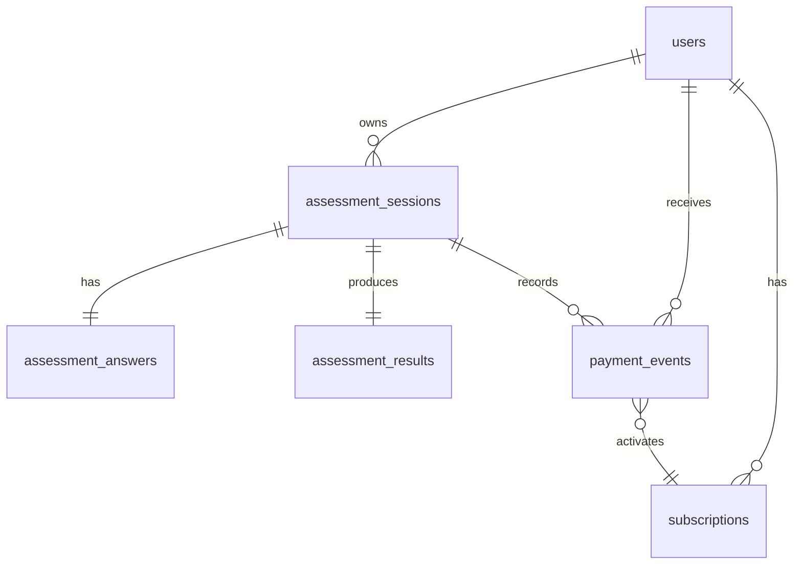

# 健康测评系统

健康测评系统 —— 匿名 session、分步问卷、健康评估算法、模拟支付和完整报告解锁的 MVP 全栈应用。

**一期开发已完成**：数据库访问层、4 个领域服务、6 个 API 端点、错误处理框架、安全权限控制（allowlist 深度清洗），以及三层测试覆盖（单元/集成/E2E，共 59 个用例全部通过）。

## 已实现功能

- ✅ 匿名 session 创建与恢复（`POST /api/sessions`）
- ✅ 分步问卷进度保存（`PATCH /api/assessments/{sessionId}/steps/{stepKey}`）
- ✅ 问卷进度恢复（`GET /api/assessments/{sessionId}/progress`）
- ✅ 测评提交与健康评估算法（`POST /api/assessments/{sessionId}/submit`）
- ✅ 按订阅状态读取结果（`GET /api/results/{sessionId}`）
- ✅ 模拟支付解锁（`POST /api/pay`）
- ✅ 健康评估算法：BMI、BMR (Mifflin-St Jeor)、TDEE、热量目标、预测日期
- ✅ 权限裁剪：非会员自动清洗受保护字段（allowlist 机制）
- ✅ 状态机：DRAFT → READY_TO_SUBMIT → SUBMITTED（含版本冲突检测与幂等）
- ✅ 错误处理：11 个业务错误码统一 `{ code, message, details? }` 响应
- ✅ 三层测试：单元测试（38）、接口集成（15）、权限安全（3）、E2E（6）—— 共 59 个用例全部通过

## 快速启动

### 本地开发（Mock Server，无需数据库）

```bash
npm run mock:dev
```

打开：

```text
http://localhost:3000
```

### 标准开发流程（需要 PostgreSQL）

```bash
npm install
cp .env.example .env
# 编辑 .env 填入 DATABASE_URL
npx prisma migrate dev
npm run dev
```

## 测试说明

```bash
npm run typecheck      # TypeScript 类型检查
npm run lint           # ESLint 代码检查
npm test               # 单元测试（38 个用例）
npm run test:integration  # 接口集成测试（15 个用例）
npm run test:e2e       # E2E 端到端测试（6 个用例）
```

> 一期测试结果：**59/59 全部通过**（单元 38 + 集成 15 + 权限 3 + E2E 6）。
> 注意：集成测试使用 Mock Prisma Client，E2E 测试使用 Mock Server，未连接真实数据库。

## 演示用测试会话

| 会话 ID | 说明 |
|---------|------|
| `demo_paid_session_001` | 已支付演示会话，可直接查看完整报告 |
| `demo_session` | 未支付演示会话，可体验支付解锁流程 |

模拟支付示例：

```bash
curl -X POST http://localhost:3000/api/pay \
  -H "Content-Type: application/json" \
  -d '{"sessionId":"demo_paid_session_001","idempotencyKey":"demo-pay-001","provider":"mock","plan":"monthly"}'
```

## 核心 API

| 方法 | 路径 | 用途 |
| --- | --- | --- |
| POST | `/api/sessions` | 创建或恢复匿名 session |
| GET | `/api/assessments/{sessionId}/progress` | 恢复问卷进度 |
| PATCH | `/api/assessments/{sessionId}/steps/{stepKey}` | 保存某一步答案 |
| POST | `/api/assessments/{sessionId}/submit` | 提交问卷并生成结果 |
| GET | `/api/results/{sessionId}` | 按订阅状态读取结果 |
| POST | `/api/pay` | 模拟支付解锁 |

## 数据库 Schema



## 文档索引

- `docs/api.md`：接口契约、错误码、字段边界。
- `docs/erd.md`：ERD 与关键表说明。
- `docs/algorithm.md`：健康评估算法契约。
- `docs/state-machine.md`：状态机与事务边界。
- `docs/test-plan.md`：测试矩阵与验收标准。
- `docs/development-handoff.md`：下一阶段开发交接。
- `docs/ai-retrospective.md`：AI 协作复盘。

## AI 使用复盘

详见 [`docs/ai-retrospective.md`](docs/ai-retrospective.md)，记录了一期开发中 AI 辅助的策略、效果评估和经验总结。

## 部署说明

推荐最终组合为 Vercel + Supabase/Neon + GitHub Actions。当前阶段不连接公网，部署动作暂不执行；后续阶段应在 CI 中跑通 typecheck、lint、unit、integration 和 e2e。

## 非医疗诊断提示

系统输出仅用于一般健康管理参考，不构成医疗诊断或治疗建议。涉及疾病、药物、特殊人群或明显异常指标时，应提示用户咨询专业医疗人员。
