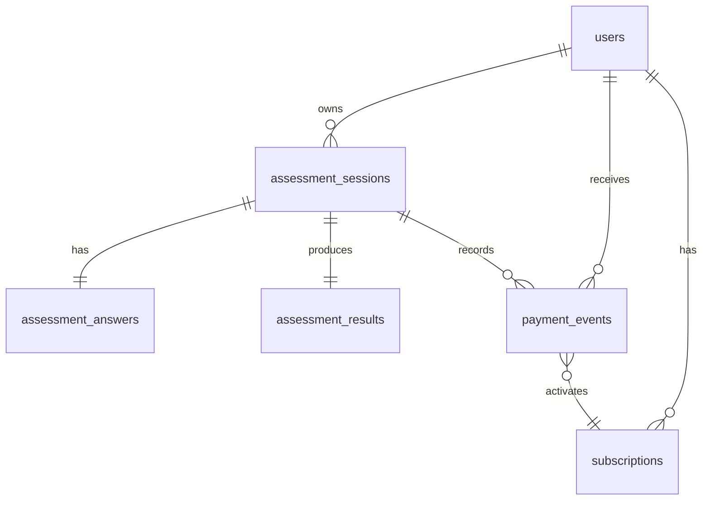

# 健康测评系统

健康测评系统 —— 匿名 session、分步问卷、健康评估算法、模拟支付和完整报告解锁的 MVP 全栈应用。

**三天构建计划全部完成**：数据库访问层、4 个领域服务、6 个 API 端点、错误处理框架、安全权限控制（allowlist 深度清洗）、四层测试覆盖（单元/集成/权限安全/E2E）、CI 流水线、部署配置与完整文档。

[](https://github.com/cerise-bouquet/healthcare/actions/workflows/ci.yml)

## 已实现功能

- ✅ 匿名 session 创建与恢复（`POST /api/sessions`）
- ✅ 分步问卷进度保存（`PATCH /api/assessments/{sessionId}/steps/{stepKey}`）
- ✅ 问卷进度恢复（`GET /api/assessments/{sessionId}/progress`）
- ✅ 测评提交与健康评估算法（`POST /api/assessments/{sessionId}/submit`）
- ✅ 按订阅状态读取结果（`GET /api/results/{sessionId}`）
- ✅ 模拟支付解锁（`POST /api/pay`）
- ✅ 健康评估算法：BMI、BMR (Mifflin-St Jeor)、TDEE、热量目标、预测日期
- ✅ 权限裁剪：非会员自动清洗受保护字段（allowlist 机制）
- ✅ 状态机：DRAFT → READY_TO_SUBMIT → SUBMITTED（含版本冲突检测与幂等）
- ✅ 错误处理：11 个业务错误码统一 `{ code, message, details? }` 响应
- ✅ 四层测试：单元测试、接口集成、权限安全、并发测试、E2E
- ✅ GitHub Actions CI：typecheck + lint + unit + integration + e2e（门控合并）
- ✅ Vercel 部署配置（hkg1 区域）
- ✅ 用户注册/登录：邮箱+密码认证，token 持久化，登录后可查看测评历史
- ✅ 测评历史：查看、恢复未完成测评、回顾已完成结果
- ✅ 完整前端 UI：落地页 + 分步问卷向导 + 结果页 + 付费弹窗 + 认证弹窗

## 快速启动

### 本地开发（Mock Server，无需数据库）

```bash
npm run mock:dev
```

打开：

```text
http://localhost:3000
```

### 标准开发流程（需要 PostgreSQL）

```bash
npm install
cp .env.example .env
# 编辑 .env 填入 DATABASE_URL
npx prisma migrate dev
npm run dev
```

## 测试说明

```bash
npm run typecheck      # TypeScript 类型检查
npm run lint           # ESLint 代码检查
npm test               # 单元测试（38 个用例）
npm run test:integration  # 接口集成测试（含并发测试，30+ 个用例）
npm run test:e2e       # E2E 端到端测试（7 个用例）
```

> 全部测试用例通过。集成测试使用 Mock Prisma Client，E2E 测试使用 Mock Server，未连接真实数据库。

## CI / CD

每次 push 到 `main` 分支或创建 PR 时，GitHub Actions 自动执行：

| 检查项 | 说明 |
|--------|------|
| Type Check | `tsc --noEmit` |
| Lint | `next lint` |
| Unit Tests | Vitest 运行单元测试 |
| Integration Tests | Vitest 运行集成测试 |
| E2E Tests | Playwright 运行端到端测试 |

所有检查通过后才能合并（`all-checks` 门控）。

## 部署

推荐部署方案：

1. **Vercel** （Next.js 原生支持）—— 连接此仓库即可自动部署
2. **Supabase / Neon** —— 托管 PostgreSQL，提供 `DATABASE_URL`
3. **GitHub Actions** —— CI 已配置，可扩展 CD 部署步骤

### 部署检查清单

- [ ] 在 Vercel 中配置 `DATABASE_URL` 环境变量
- [ ] 设置 `ALGORITHM_VERSION` 环境变量
- [ ] 执行 `npx prisma migrate deploy`（或通过 Vercel build 钩子）
- [ ] 确认 CI 全部通过

## 演示用测试会话

| 会话 ID | 说明 |
|---------|------|
| `demo_paid_session_001` | 已支付演示会话，可直接查看完整报告 |
| `demo_session` | 未支付演示会话，可体验支付解锁流程 |

模拟支付示例：

```bash
curl -X POST http://localhost:3000/api/pay \
  -H "Content-Type: application/json" \
  -d '{"sessionId":"demo_paid_session_001","idempotencyKey":"demo-pay-001","provider":"mock","plan":"monthly"}'
```

## 核心 API

| 方法 | 路径 | 用途 |
| --- | --- | --- |
| POST | `/api/sessions` | 创建或恢复匿名 session |
| GET | `/api/assessments/{sessionId}/progress` | 恢复问卷进度 |
| PATCH | `/api/assessments/{sessionId}/steps/{stepKey}` | 保存某一步答案 |
| POST | `/api/assessments/{sessionId}/submit` | 提交问卷并生成结果 |
| GET | `/api/results/{sessionId}` | 按订阅状态读取结果 |
| POST | `/api/pay` | 模拟支付解锁 |

## 数据库 Schema



## 文档索引

| 文档 | 内容 |
|------|------|
| `docs/api.md` | 接口契约、请求/响应示例、错误码 |
| `docs/erd.md` | 数据库 ERD 与表说明 |
| `docs/algorithm.md` | 健康评估算法契约 |
| `docs/state-machine.md` | 状态机与事务边界 |
| `docs/test-plan.md` | 测试矩阵与验收标准 |
| `docs/development-handoff.md` | 项目交接说明（架构决策、后续工作） |
| `docs/ai-retrospective.md` | AI 协作复盘（策略、审查、修正、否决） |

## AI 使用复盘

详见 [`docs/ai-retrospective.md`](docs/ai-retrospective.md)，记录了三天构建中 AI 辅助的策略：
- **拆解方式：** 按五个领域域拆分，API 层仅保留胶水代码
- **使用 AI：** Schema 候选、测试矩阵、异常样本、算法草案、CI 配置
- **人工审查：** 字段边界、权限泄露、幂等处理、状态机一致性
- **修正案例：** 答案存储策略、权限实现方式、过期策略
- **否决案例：** 前端隐藏付费字段、自增 ID、URL 传参、客户端缓存算法结果

## 非医疗诊断提示

系统输出仅用于一般健康管理参考，不构成医疗诊断或治疗建议。涉及疾病、药物、特殊人群或明显异常指标时，应提示用户咨询专业医疗人员。
