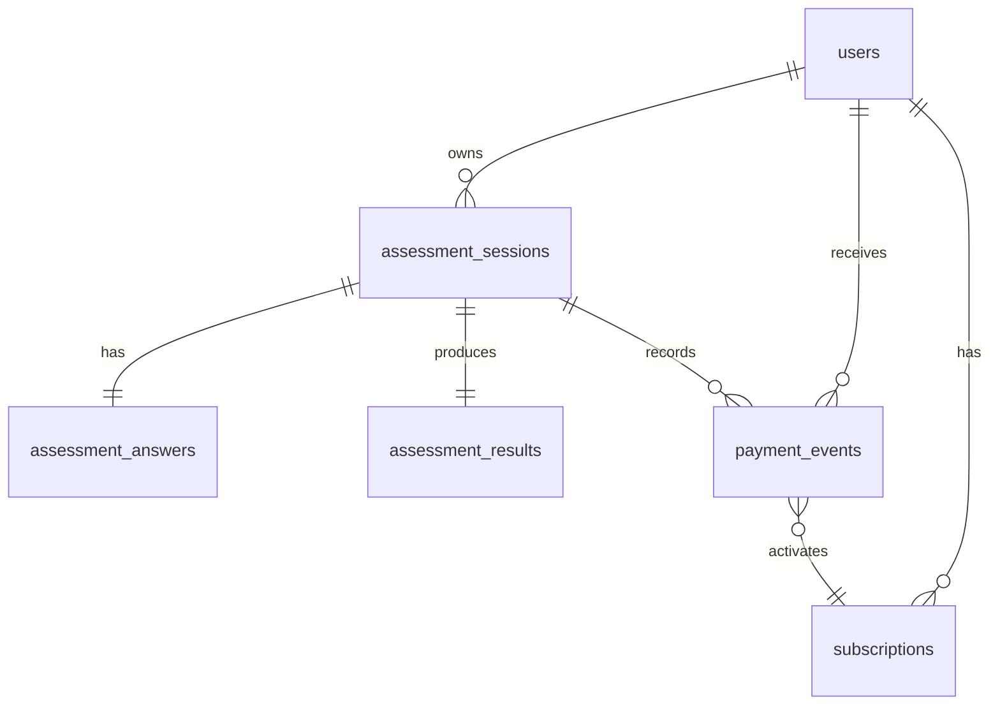

# 数据库 ERD

## 表说明

| 表 | 责任 |
| --- | --- |
| users | 匿名用户身份，后续可绑定账号。 |
| assessment_sessions | 一次测评流程的状态主表，保存 currentStep、completedSteps、version。 |
| assessment_answers | 核心答案结构化保存，扩展题放 extraAnswers。 |
| assessment_results | 服务端计算结果，publicPayload 与 protectedPayload 分离。 |
| subscriptions | 当前与历史订阅状态。 |
| payment_events | 模拟支付事件审计，idempotencyKey 唯一。 |
